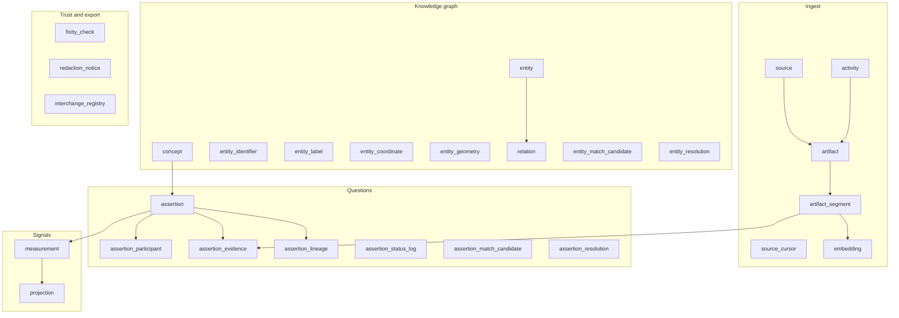

# Question Better. — data model guide

How every table in `backend/schema/intel_foundation.sql` maps to **Question Better.**, with references to industry standards.

**Schema file:** `backend/schema/intel_foundation.sql`  
**Apply locally:** `./scripts/dev.sh db migrate` (Alembic)

---

## Why this schema fits Question Better

The `intel` schema is a **generic knowledge + evidence + signals** basement. It was designed around:

| Standard | What it provides | Our use |
|----------|------------------|---------|
| [W3C PROV-DM](https://www.w3.org/TR/prov-dm/) | **Entities**, **activities**, **agents**, derivations, provenance | Questions trace back to sources and jobs that created them |
| [OAIS ISO 14721](https://www.iso.org/standard/57284.html) | Archival packages, **fixity**, preservation metadata | Uploaded PDFs stay tamper-evident; integrity audits for high-stakes exams |
| [1EdTech QTI](https://www.1edtech.org/standards/qti) | Portable assessment items, tests, scoring | Export/import question packs to LMS and partner systems |
| [1EdTech Caliper](https://www.1edtech.org/standards/caliper) | **Assessment** and **Assessment Item** learning events | Answer events, attempts, timing — the flywheel data |
| Item Response Theory (IRT) | Calibrated item banks: difficulty, discrimination, person ability on one scale | `projection` stores calibrated stats; `measurement` feeds calibration |

> **Core idea:** A multiple-choice question is an **assertion** (a testable claim). An answer is a **measurement** (an observation). Mastery scores are **projections** (derived, disposable). Source PDFs are **artifacts** (immutable evidence). Everything else connects the graph.

---

## Architecture at a glance



---

## Quick reference — all 27 tables

| # | Table | One-line purpose (Question Better) | Phase |
|---|-------|-----------------------------------|-------|
| 1 | `concept` | Controlled vocabulary: topics, question types, metrics, link types | 1 |
| 2 | `source` | Origin channel: user upload, YouTube, publisher API | 1 |
| 3 | `source_cursor` | Bookmark for incremental sync on repeating feeds | 2+ |
| 4 | `activity` | Background job runs: generate, embed, evaluate, export | 1 |
| 5 | `artifact` | Immutable source file or payload (PDF, transcript) | 1 |
| 6 | `artifact_segment` | Text chunk with page/offset — generation input + citation | 1 |
| 7 | `fixity_check` | Prove stored file still matches its checksum | 3+ |
| 8 | `redaction_notice` | Copyright takedown, GDPR, exam leak retraction | 3+ |
| 9 | `entity` | Stable thing: student, exam, course, topic, institution | 1–2 |
| 10 | `entity_identifier` | External IDs: email, ISBN, board paper code, video ID | 2 |
| 11 | `entity_label` | Display names and aliases over time (incl. i18n) | 2 |
| 12 | `entity_coordinate` | Point location: exam center, region analytics | 3+ |
| 13 | `entity_geometry` | Regions: map questions, district rollout, heatmaps | 3+ |
| 14 | `entity_match_candidate` | “Are these two courses/topics the same?” dedup queue | 3+ |
| 15 | `entity_resolution` | Final merge/split decision for entity dedup | 3+ |
| 16 | `relation` | Typed link: enrolled_in, prepares_for, part_of, teaches | 2 |
| 17 | `assertion` | **Questions** and learnable claims (MCQ in `payload`) | 1 |
| 18 | `assertion_status_log` | Audit when a question is revised, superseded, retracted | 1 |
| 19 | `assertion_participant` | Entities in a question: skill tested, author, case subject | 2 |
| 20 | `assertion_evidence` | Question → source segment (citation / provenance) | 1 |
| 21 | `assertion_lineage` | Question graph: prerequisite, variant, follow_up, harder_than | 2 |
| 22 | `assertion_match_candidate` | Near-duplicate question detection queue | 3+ |
| 23 | `assertion_resolution` | Merge or keep separate duplicate questions | 3+ |
| 24 | `projection` | Calibrated difficulty, mastery, readiness (IRT outputs) | 2 |
| 25 | `measurement` | **Every answer event** — correct, time, confidence | 1 |
| 26 | `embedding` | Semantic vectors on segments, questions, entities | 1–2 |
| 27 | `interchange_registry` | Exported bundles: QTI, JSON-LD, partner packs | 4+ |

**Phase key:** 1 = Year 1 core · 2 = graph + calibration · 3+ = scale, compliance, geo · 4+ = B2B API / export

---

## Table-by-table reference

### Vocabulary

#### `intel.concept`

**Schema role:** Canonical taxonomy — hierarchical types with URI, family, label, `metadata` JSONB.

**Question Better use:**

| Family (examples) | Examples |
|-------------------|----------|
| Topic tree | `Mathematics → Algebra → Factoring` |
| `assertion_type` | `question.mcq`, `question.true_false`, `question.multi_select` |
| `metric_type` | `answer.correct`, `answer.latency_ms`, `confidence.self_report` |
| `link_type` | `prerequisite`, `variant`, `follow_up_after_miss`, `harder_than` |
| `activity_type` | `generate_questions`, `embed_segments`, `evaluate_quality` |
| Bloom / difficulty | `bloom.recall`, `bloom.apply`, `difficulty.estimated` |

**Standard alignment:** Shared vocabulary resembles [Caliper](https://www.1edtech.org/standards/caliper) metric profiles and [QTI](https://www.1edtech.org/standards/qti) item metadata — one controlled language across the product.

**Example:** Tag an MCQ assertion with concept `/topic/algebra/factoring` via `assertion_participant` or `payload` references.

---

### Ingest and provenance

#### `intel.source`

**Schema role:** A channel or pipeline that produces artifacts.

**Question Better use:**

| Slug | Meaning |
|------|---------|
| `user-upload` | Student or teacher uploads PDF / notes |
| `youtube` | Transcript ingest from video |
| `publisher-ncert` | External syllabus or question feed |
| `community` | User-submitted packs |

**Standard alignment:** [PROV-DM](https://www.w3.org/TR/prov-dm/) — source is part of the provenance chain (“where did this material enter the system?”).

---

#### `intel.source_cursor`

**Schema role:** Key/value bookmark per source for incremental ingest.

**Question Better use:**

- YouTube playlist: last processed `video_id`
- RSS exam updates: last `item_guid`
- Partner API: pagination `offset` / `since` timestamp

**When:** Any feed that updates continuously. Not needed for one-off PDF uploads.

---

#### `intel.activity`

**Schema role:** A job run — agent, status, timing, stats, errors.

**Question Better use:**

| Activity type | What runs |
|---------------|-----------|
| `generate_questions` | Segment → MCQ via LLM |
| `embed_segments` | Chunk → vector in `embedding` |
| `evaluate_quality` | Ambiguity / discrimination check |
| `build_projections` | Recalculate IRT-style stats |
| `export_pack` | Write QTI bundle → `interchange_registry` |

**Standard alignment:** [PROV-DM Activity](https://www.w3.org/TR/prov-primer/) — “something that occurs over time and acts upon entities.” Every generated question should reference the `activity_id` that created it.

---

#### `intel.artifact`

**Schema role:** Immutable captured evidence — INSERT-only, `content_hash`, `storage_uri` (MinIO), optional `payload` JSONB.

**Question Better use:**

- Uploaded PDF chapter
- Pasted notes (JSON payload)
- Frozen web page snapshot
- Official syllabus PDF for an exam

**Standard alignment:** [OAIS](https://www.iso.org/standard/57284.html) Content Information — the bitstream behind a question. [Digital Preservation Handbook on fixity](https://www.dpconline.org/handbook/technical-solutions-and-tools/fixity-and-checksums): checksum on `artifact` is the reference fingerprint.

**Immutability:** Updates are forbidden by trigger. New version = new artifact row.

---

#### `intel.artifact_segment`

**Schema role:** Chunk of an artifact — `text_content`, page, char range, full-text index.

**Question Better use:**

- Input chunks for question generation (RAG)
- Exact citation: “Page 12, paragraph 3”
- User-selected highlight region
- Video transcript time range (in `payload`)

**Standard alignment:** Derivation in PROV — questions are *derived from* segments via `assertion_evidence`.

---

#### `intel.embedding`

**Schema role:** Vector on `entity`, `assertion`, or `artifact_segment` for a given model.

**Question Better use:**

- Retrieve relevant chunks before generating questions
- “Questions like this one” for practice
- Semantic duplicate detection (feeds `assertion_match_candidate`)
- Cluster misconceptions across similar wrong answers

**Requires:** `pgvector` extension (already in schema).

---

### Integrity and compliance

#### `intel.fixity_check`

**Schema role:** Record of verifying an artifact still matches its hash.

**Question Better use:**

- Certification mode: prove syllabus PDF unchanged on exam day
- Periodic MinIO integrity audit (data scrubbing)
- Enterprise SLA: documented chain of custody

**Standard alignment:** [OAIS Fixity Information](https://www.dpconline.org/handbook/technical-solutions-and-tools/fixity-and-checksums) — “mechanisms that ensure the Content Data Object has not been altered in an undocumented manner.”

---

#### `intel.redaction_notice`

**Schema role:** Legal or policy masking of artifact or assertion with reason.

**Question Better use:**

- DMCA / copyright takedown on uploaded textbook
- GDPR erasure on personal data in shared content
- Exam leak: hide compromised questions while keeping audit trail
- Moderation: offensive user uploads

**When:** Platform scale + trust. Not day-one, but the table is ready.

---

### World model (entities and graph)

#### `intel.entity`

**Schema role:** Stable thing with a type concept — person, organization, document, event, etc.

**Question Better use:**

| Type concept | Examples |
|--------------|----------|
| `person` | Student, teacher, item author |
| `organization` | School, coaching institute, publisher |
| `document` | “NEET 2024 Paper”, “Chapter 5” |
| `event` | Mock test session, official exam date |
| `category` | Subject, exam board, skill node |

**Standard alignment:** [PROV-DM Entity](https://www.w3.org/TR/prov-o/) — “physical, digital, conceptual thing with fixed aspects.”

---

#### `intel.entity_identifier`

**Schema role:** External ID under a scheme concept — `(scheme, value)` per entity.

**Question Better use:**

| Scheme | Example |
|--------|---------|
| `email` | `priya@school.edu` |
| `isbn` | Textbook identifier |
| `exam_paper_id` | `CBSE-2024-PHY-01` |
| `youtube_video_id` | Source video |
| `publisher_sku` | Licensed question pack |

**Why:** Integrate catalogs without inventing parallel ID systems.

---

#### `intel.entity_label`

**Schema role:** Human-readable name for an entity, valid over time.

**Question Better use:**

- Student display name changes
- Topic aliases: “Factoring” = “Factorisation”
- Multi-language labels (Hindi + English for same concept)
- Exam rename history

---

#### `intel.entity_coordinate`

**Schema role:** Point lat/long for a place-related entity.

**Question Better use:**

- Geography MCQ content
- Exam center locations
- Regional performance analytics (aggregated)
- Coaching center pins on a map

---

#### `intel.entity_geometry`

**Schema role:** GeoJSON / polygon regions (PostGIS optional).

**Question Better use:**

- Map-based assessment items (borders, river basins)
- “Schools in this district” for B2B sales
- Regional difficulty heatmaps (display layer; stats still in `projection`)

**Standard alignment:** GeoJSON [RFC 7946](https://datatracker.ietf.org/doc/html/rfc7946) (referenced in schema header).

---

#### `intel.relation`

**Schema role:** Directed typed edge between entities with confidence and validity window.

**Question Better use:**

| Relation | Example |
|----------|---------|
| `enrolled_in` | Student → Course |
| `prepares_for` | Course → Exam |
| `part_of` | Chapter → Book |
| `teaches` | Teacher → Subject |
| `authored_by` | Question pack → Person |
| `prerequisite_of` | Topic entity → Topic entity |

**Standard alignment:** Knowledge graph edge — complements `assertion_lineage` (question-level) with org/course-level structure.

---

#### `intel.entity_match_candidate` + `intel.entity_resolution`

**Schema role:** Dedup pipeline — “might be same entity” → resolved outcome.

**Question Better use:**

- Merge duplicate topic nodes from imports
- Same PDF uploaded twice by different users
- “Khan Algebra Basics” vs “Algebra Basics - Khan” — one canonical course
- Publisher entity normalization

**Standard alignment:** [PROV-DM Component 5](https://www.w3.org/TR/prov-dm/) — linking entities that refer to the same thing.

---

### Questions (assertions)

#### `intel.assertion`

**Schema role:** Structured claim with `payload` JSONB, confidence, lifecycle (`active` / `superseded` / `retracted`), full-text search.

**Question Better use — this is your question bank:**

```json
{
  "stem": "What is (a+b)² expanded?",
  "choices": ["a²+b²", "a²+2ab+b²", "a²+ab+b²", "2a+2b"],
  "correct_index": 1,
  "explanation": "Use the binomial identity (a+b)² = a² + 2ab + b².",
  "estimated_difficulty": 0.62,
  "bloom_level": "apply"
}
```

Also stores flashcard claims, rubric definitions, or meta-assertions (“item discriminates well”).

**Standard alignment:**

- [QTI Assessment Item](https://www.1edtech.org/standards/qti) — portable item model; export via `interchange_registry`
- [IRT item bank](https://www.ituonline.com/tech-definitions/what-is-item-response-theory-irt/) — items with calibrated parameters live here; calibration outputs go to `projection`

**Versioning:** Improve a question → new assertion row or supersede; history in `assertion_status_log`.

---

#### `intel.assertion_status_log`

**Schema role:** Append-only audit when assertion status changes (auto-trigger).

**Question Better use:**

- Question revised after user reports
- Retracted due to error or leak
- Superseded by improved wording
- Compliance trail for high-stakes items

---

#### `intel.assertion_participant`

**Schema role:** Links assertion to entities with roles.

**Question Better use:**

- Question **tests** skill entity “Quadratic equations”
- **Authored by** teacher entity
- **Approved by** moderator
- Case-study MCQ involving company + person entities

---

#### `intel.assertion_evidence`

**Schema role:** Links assertion to artifact segment with evidence role.

**Question Better use:**

- Primary source citation for correct answer
- Multiple segments supporting one item
- Distractor inspired by common misconception passage

**Standard alignment:** [PROV-DM derivation](https://www.w3.org/TR/prov-primer/) — question wasGeneratedFrom segment.

---

#### `intel.assertion_lineage`

**Schema role:** Typed directed links between assertions.

**Question Better use — the Question Graph:**

| Link type | Example |
|-----------|---------|
| `prerequisite` | Basic algebra MCQ before factoring MCQ |
| `follow_up_after_miss` | Easier remediation question |
| `variant` | Same concept, different wording |
| `harder_than` | Adaptive difficulty chain |
| `duplicate_of` | Soft link before hard resolution |

---

#### `intel.assertion_match_candidate` + `intel.assertion_resolution`

**Schema role:** Near-duplicate assertion detection and merge decisions.

**Question Better use:**

- Import 10k questions — find duplicates
- AI generates near-copy of existing item
- Cross-publisher dedup
- Community submission review

**Standard alignment:** Item bank hygiene per [Ofqual on-demand testing / IRT item banks](https://assets.publishing.service.gov.uk/media/5a823e30ed915d74e34027d9/0210_QingpingHe_Maintaining-standards.pdf) — banks must exclude misfitting or duplicate items.

---

### Signals (the flywheel)

#### `intel.measurement`

**Schema role:** Time-stamped observation — numeric, text, or JSON value linked to entity and/or assertion.

**Question Better use — every answer event:**

| Metric concept | Stored as |
|----------------|-----------|
| `answer.correct` | `value_numeric` 0 or 1 |
| `answer.latency_ms` | `value_numeric` |
| `answer.choice_index` | `value_numeric` |
| `confidence.self_report` | `value_numeric` 1–5 |
| `hint.used` | `value_numeric` 0/1 |
| Session score | `value_json` |

Link `source_assertion_id` → the question. Link `subject_entity_id` → the student.

**Standard alignment:**

- [Caliper Assessment Item events](https://www.1edtech.org/standards/caliper) — actor, action, object, time
- [IRT response data](https://link.springer.com/article/10.3758/s13428-025-02796-y) — cross-classified by person × item; required for calibration

**Immutability:** INSERT-only trigger. Answers are never silently rewritten.

---

#### `intel.projection`

**Schema role:** Disposable computed snapshot at `as_of` — JSON `value`, tied to entity or assertion.

**Question Better use:**

| Projection type | Value example |
|-----------------|---------------|
| `item.difficulty` | IRT b-parameter, calibrated |
| `item.discrimination` | IRT a-parameter |
| `student.mastery` | Per-topic score 0–1 |
| `student.exam_readiness` | Predicted pass probability |
| `item.quality_grade` | Evaluator model output |
| `srs.due_date` | Spaced repetition schedule |

**Standard alignment:** [IRT calibration workflow](https://www.ituonline.com/tech-definitions/what-is-item-response-theory-irt/) — pilot responses → estimate parameters → store on common scale → exclude misfitting items.

**Why separate from `measurement`:** Raw events are permanent; derived stats are rebuilt as models improve.

---

### Interchange

#### `intel.interchange_registry`

**Schema role:** Record of exporting a resource to an external URI/format with hash.

**Question Better use:**

- Export question pack as [QTI 3.0](https://www.1edtech.org/standards/qti) zip for LMS import
- JSON-LD bundle with PROV provenance for research partners
- Institutional backup with content hash
- “Stripe for assessment” — partners consume registered export URIs

**Standard alignment:** QTI for items/tests; PROV-O listed as supported format in schema for provenance bundles.

---

## End-to-end example

**Priya** (`entity` + `entity_identifier`) is `enrolled_in` (`relation`) **NEET Prep 2026** (`entity`).

1. She uploads a PDF → `source` `user-upload`, `artifact` in MinIO, `activity` `generate_questions`
2. PDF split → `artifact_segment`; vectors → `embedding`
3. System creates 5 MCQs → `assertion` (type `question.mcq`), each with `assertion_evidence` → segment
4. Topics tagged → `concept` + `assertion_participant` → skill entities
5. Prerequisites linked → `assertion_lineage`
6. Priya answers → `measurement` (correct, latency)
7. Mastery updated → `projection` `student.mastery`
8. Similar practice suggested → `embedding` nearest-neighbor on assertions
9. Near-duplicate import flagged → `assertion_match_candidate` → `assertion_resolution`
10. Leaked item retracted → `assertion` status + `assertion_status_log`; optional `redaction_notice`
11. Syllabus integrity verified → `fixity_check`
12. School exports pack → `interchange_registry` format `qti`

---

## PROV-DM mapping summary

| PROV concept | `intel` table(s) |
|--------------|------------------|
| Entity | `entity`, `artifact`, `assertion` |
| Activity | `activity` |
| Agent | `activity.agent` (e.g. `worker:generate-v1`) |
| Used | `assertion_evidence` (assertion used segment) |
| WasDerivedFrom | `assertion_lineage`, `assertion_evidence` |
| Alternate / same thing | `entity_match_candidate`, `entity_resolution` |

Source: [W3C PROV Primer](https://www.w3.org/TR/prov-primer/)

---

## Assessment industry mapping summary

| Industry concept | `intel` table(s) |
|------------------|------------------|
| Item bank | `assertion` (type `question.*`) |
| Item metadata / topics | `concept`, `assertion_participant` |
| Item calibration (IRT) | `measurement` → `projection` |
| Test assembly / graph | `assertion_lineage`, `concept` tree |
| Learning analytics events | `measurement` |
| Content interchange | `interchange_registry` + QTI export |
| Source material | `artifact`, `artifact_segment` |

Sources: [1EdTech QTI](https://www.1edtech.org/standards/qti), [Caliper Assessment Profile](https://www.imsglobal.org/spec/caliper/v1p2/impl), [IRT overview](https://www.ituonline.com/tech-definitions/what-is-item-response-theory-irt/)

---

## MCQ payload convention (application layer)

No DDL change required. Store in `intel.assertion.payload`:

```json
{
  "format": "qb.mcq.v1",
  "stem": "string",
  "choices": ["A", "B", "C", "D"],
  "correct_index": 1,
  "explanation": "string",
  "estimated_difficulty": 0.62,
  "tags": ["/topic/algebra/factoring"]
}
```

Set `type_concept_id` → concept URI `/vocab/assertion/question.mcq` (add as vocabulary row when building — no schema migration).

---

## What to build first (Year 1)

| Priority | Tables |
|----------|--------|
| **Now** | `source`, `activity`, `artifact`, `artifact_segment`, `embedding`, `assertion`, `assertion_evidence`, `concept`, `measurement` |
| **Soon** | `assertion_lineage`, `projection`, `entity`, `relation` |
| **At scale** | match/resolution tables, `fixity_check`, `redaction_notice`, `interchange_registry` |
| **As needed** | `entity_coordinate`, `entity_geometry`, `source_cursor` |

---

## References

- [W3C PROV-DM](https://www.w3.org/TR/prov-dm/) — provenance data model
- [W3C PROV Primer](https://www.w3.org/TR/prov-primer/) — entities, activities, derivations
- [ISO 14721 OAIS](https://www.iso.org/standard/57284.html) — archival fixity and preservation
- [DPC Fixity and checksums](https://www.dpconline.org/handbook/technical-solutions-and-tools/fixity-and-checksums)
- [1EdTech QTI](https://www.1edtech.org/standards/qti) — question/test interchange
- [1EdTech Caliper](https://www.1edtech.org/standards/caliper) — learning measurement events
- [Ofqual — IRT and on-demand item banks (PDF)](https://assets.publishing.service.gov.uk/media/5a823e30ed915d74e34027d9/0210_QingpingHe_Maintaining-standards.pdf)
- [Item Response Warehouse (psychometrics)](https://link.springer.com/article/10.3758/s13428-025-02796-y)

---

*Question Better. — Zivo engineering monorepo. Business copy: `README.md`. Strategy: `docs/VISION.md`.*
